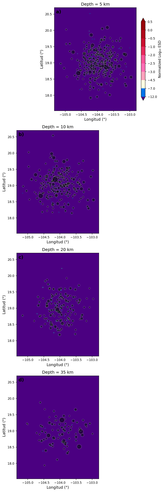
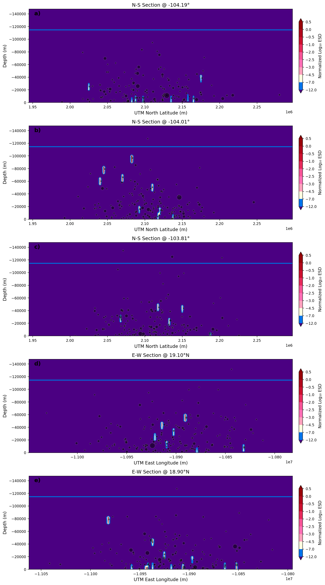

# 🎨 seismex.visualization

Módulo de visualización de SEISMEX. Proporciona herramientas para crear gráficos de alta calidad, mapas interactivos y exportación a formatos GIS.

---

## 📋 Contenido

- [Componentes](#componentes)
- [VisualizadorESD](#visualizadoresd)
- [Mapas Interactivos](#mapas-interactivos)
- [Exportación GIS](#exportación-gis)
- [Google Earth Engine](#google-earth-engine)
- [Personalización](#personalización)

---

## Componentes

| Clase | Archivo | Descripción | Estado |
|-------|---------|-------------|--------|
| `VisualizadorESD` | `plotter.py` | Visualización de resultados ESD | ✅ Completo |
| `PaletaColoresESD` | `colormaps.py` | Paleta de colores ESD | ✅ Completo |
| `MapaInteractivo` | `interactive.py` | Mapas con Folium | 🔄 En desarrollo |
| `ExportadorGIS` | `gis_export.py` | Exportación GeoTIFF/GeoJSON | 🔄 En desarrollo |
| `IntegradorGEE` | `gee_integration.py` | Google Earth Engine | 📋 Planificado |

---

## VisualizadorESD

Clase principal para visualizar resultados del análisis ESD.

### Inicialización

```python
from seismex.visualization import VisualizadorESD
from seismex.analysis import CalculadoraESD

# Calcular ESD primero
resultado = calculadora.calcular_esd(catalogo)

# Crear visualizador
viz = VisualizadorESD(
    resultado,
    dpi=150,                    # Resolución de figuras
    estilo='seismex',           # Estilo: 'seismex', 'classic', 'minimal'
    idioma='es'                 # Idioma: 'es', 'en'
)
```

### Secciones Horizontales

```python
# Una sola profundidad
fig = viz.graficar_seccion_horizontal(
    profundidad_km=30,
    mostrar_eventos=True,       # Mostrar epicentros
    mostrar_fallas=True,        # Mostrar fallas activas
    mostrar_volcanes=True,      # Mostrar volcanes
    colorbar=True,
    guardar='esd_30km.png'
)

# Múltiples profundidades (panel)
fig = viz.graficar_secciones_horizontales(
    profundidades=[10, 30, 50, 70, 100],
    columnas=3,                 # Columnas del panel
    tamanio_figura=(15, 10),
    guardar='esd_horizontales.png'
)
```

### Secciones Verticales

```python
# Perfil N-S a longitud fija
fig = viz.graficar_seccion_vertical_ns(
    longitud=-103.5,
    mostrar_moho=True,          # Línea de Moho
    mostrar_slab=True,          # Contornos de subducción
    guardar='perfil_ns.png'
)

# Perfil E-W a latitud fija
fig = viz.graficar_seccion_vertical_ew(
    latitud=19.3,
    guardar='perfil_ew.png'
)

# Múltiples perfiles
fig = viz.graficar_secciones_verticales(
    perfiles=[
        {'tipo': 'ns', 'valor': -104.0},
        {'tipo': 'ns', 'valor': -103.5},
        {'tipo': 'ew', 'valor': 19.0},
        {'tipo': 'ew', 'valor': 19.5}
    ],
    guardar='perfiles_verticales.png'
)
```

### Perfil Personalizado

```python
# Definir puntos del perfil
puntos = [
    (19.0, -104.5),   # Inicio (lat, lon)
    (19.3, -103.8),   # Punto intermedio
    (19.8, -103.0)    # Fin
]

fig = viz.graficar_perfil_personalizado(
    puntos,
    ancho_km=20,                # Ancho del swath
    guardar='perfil_custom.png'
)
```

### Vista 3D

```python
# Visualización 3D interactiva
fig = viz.graficar_3d(
    umbral_esd=-3,              # Solo mostrar ESD > umbral
    opacidad=0.7,
    mostrar_topografia=True,
    guardar='esd_3d.html'       # HTML interactivo
)
```

---

## Paleta de Colores

### PaletaColoresESD

Reproduce la paleta del artículo de Del Pezzo et al.

```python
from seismex.visualization import PaletaColoresESD

paleta = PaletaColoresESD()

# Niveles estándar
niveles = paleta.niveles_estandar
# [-12, -7, -4.5, -3.0, -2.5, -2.0, -1.0, -0.5, 0, 0.5]

# Colormap para matplotlib
cmap = paleta.obtener_colormap()

# Normalización
norm = paleta.obtener_normalizacion(vmin=-12, vmax=0.5)

# Usar en matplotlib
import matplotlib.pyplot as plt

fig, ax = plt.subplots()
im = ax.pcolormesh(X, Y, ESD, cmap=cmap, norm=norm)
plt.colorbar(im, label='log₁₀(ESD normalizado)')
```

### Colores por Nivel

| Rango | Color RGB | Hex | Interpretación |
|-------|-----------|-----|----------------|
| < -7 | (75, 0, 130) | #4B0082 | Muy bajo (índigo) |
| -7 a -4.5 | (0, 0, 255) | #0000FF | Bajo (azul) |
| -4.5 a -3 | (0, 128, 255) | #0080FF | Bajo-moderado |
| -3 a -2 | (0, 255, 128) | #00FF80 | Moderado (verde) |
| -2 a -1 | (128, 255, 0) | #80FF00 | Moderado-alto |
| -1 a -0.5 | (255, 128, 192) | #FF80C0 | Alto (rosa) |
| > -0.5 | (255, 0, 0) | #FF0000 | Muy alto (rojo) |

---

## Mapas Interactivos

### MapaInteractivo (Folium)

```python
from seismex.visualization import MapaInteractivo

# Crear mapa base
mapa = MapaInteractivo(
    centro=(19.3, -103.5),
    zoom=8,
    tiles='CartoDB positron'    # 'OpenStreetMap', 'Stamen Terrain', etc.
)

# Agregar capa ESD
mapa.agregar_capa_esd(
    resultado_esd,
    profundidad_km=30,
    opacidad=0.7,
    mostrar_colorbar=True
)

# Agregar epicentros
mapa.agregar_epicentros(
    catalogo,
    color_por='magnitud',
    tamanio_por='magnitud',
    popup=True                  # Información al hacer clic
)

# Agregar capas adicionales
mapa.agregar_fallas('mexico_fallas.geojson')
mapa.agregar_volcanes('mexico_volcanes.geojson')
mapa.agregar_ciudades(['Colima', 'Guadalajara', 'Manzanillo'])

# Control de capas
mapa.agregar_control_capas()

# Guardar
mapa.guardar('mapa_esd_interactivo.html')
```

### Animación Temporal

```python
# Crear animación de evolución temporal
mapa.crear_animacion_temporal(
    catalogo,
    resultado_esd,
    ventana_dias=365,
    paso_dias=30,
    guardar='animacion_esd.html'
)
```

---

## Exportación GIS

### ExportadorGIS

```python
from seismex.visualization import ExportadorGIS

exportador = ExportadorGIS(resultado_esd)

# Exportar a GeoTIFF
exportador.exportar_geotiff(
    'esd_30km.tif',
    profundidad_km=30,
    crs='EPSG:4326',            # Sistema de referencia
    resolucion_m=1000           # Resolución en metros
)

# Exportar múltiples profundidades
exportador.exportar_geotiff_stack(
    'esd_stack.tif',
    profundidades=[10, 20, 30, 40, 50],
    metadatos={
        'autor': 'SEISMEX',
        'fecha': '2024-01-01',
        'descripcion': 'ESD Colima'
    }
)

# Exportar a GeoJSON (contornos)
exportador.exportar_geojson(
    'esd_contornos.geojson',
    profundidad_km=30,
    niveles=[-3, -2, -1, 0]     # Niveles de contorno
)

# Exportar a Shapefile
exportador.exportar_shapefile(
    'esd_contornos',
    profundidad_km=30
)

# Exportar catálogo a GeoPackage
exportador.exportar_catalogo_gpkg(
    'catalogo.gpkg',
    catalogo,
    incluir_esd=True            # Agregar valor ESD a cada evento
)
```

### Formatos Soportados

| Formato | Extensión | Descripción | Estado |
|---------|-----------|-------------|--------|
| GeoTIFF | .tif | Raster georreferenciado | ✅ |
| GeoJSON | .geojson | Vectores JSON | ✅ |
| Shapefile | .shp | ESRI Shapefile | 🔄 |
| GeoPackage | .gpkg | Base de datos espacial | 📋 |
| KML/KMZ | .kml/.kmz | Google Earth | 📋 |
| NetCDF | .nc | Datos científicos | 📋 |

---

## Google Earth Engine

### Estado: 📋 Planificado

### Diseño Propuesto

```python
from seismex.visualization import IntegradorGEE

# Inicializar (requiere autenticación GEE)
gee = IntegradorGEE()
gee.autenticar()

# Subir resultados como Asset
asset_id = gee.subir_esd(
    resultado_esd,
    nombre='seismex/esd_colima_2024',
    descripcion='ESD Colima 2020-2024'
)

# Crear visualización
viz_params = {
    'bands': ['esd'],
    'min': -12,
    'max': 0,
    'palette': paleta.obtener_hex_list()
}

# Generar mapa
mapa_gee = gee.crear_mapa(
    asset_id,
    viz_params,
    region=ee.Geometry.Rectangle([-105, 18, -102, 21])
)

# Exportar a Earth Engine Apps
gee.publicar_app(
    mapa_gee,
    nombre='SEISMEX ESD Viewer',
    descripcion='Visualizador de Energy Space Density'
)
```

### Capas Base Disponibles (GEE)

| Capa | Descripción |
|------|-------------|
| `ee.Image("USGS/SRTMGL1_003")` | Topografía SRTM |
| `ee.Image("NASA/NASADEM_HGT/001")` | NASADEM |
| `ee.FeatureCollection("FAO/GAUL/2015/level1")` | Límites administrativos |
| `ee.Image("CGIAR/SRTM90_V4")` | SRTM 90m |

---

## Personalización

### Estilos Predefinidos

```python
# Estilo 'seismex' (default)
viz = VisualizadorESD(resultado, estilo='seismex')

# Estilo 'classic' (matplotlib default)
viz = VisualizadorESD(resultado, estilo='classic')

# Estilo 'minimal' (publicación)
viz = VisualizadorESD(resultado, estilo='minimal')

# Estilo 'dark' (fondo oscuro)
viz = VisualizadorESD(resultado, estilo='dark')
```

### Personalización Avanzada

```python
# Configuración personalizada
config_viz = {
    'fuente_titulo': 'Arial',
    'tamano_titulo': 14,
    'fuente_ejes': 'Arial',
    'tamano_ejes': 12,
    'colorbar_orientacion': 'vertical',
    'colorbar_shrink': 0.8,
    'grid_alpha': 0.3,
    'linea_costa': True,
    'color_oceano': '#e6f3ff'
}

viz = VisualizadorESD(resultado, config=config_viz)
```

### Agregar Elementos Personalizados

```python
# Obtener axes para personalización
fig, ax = viz.crear_figura_base(profundidad_km=30)

# Agregar elementos personalizados
ax.plot(-103.5, 19.3, 'k^', markersize=10, label='Volcán Colima')
ax.annotate('Volcán de Fuego', (-103.5, 19.3), fontsize=8)

# Agregar escala
from matplotlib_scalebar.scalebar import ScaleBar
ax.add_artist(ScaleBar(111.32, location='lower left'))

# Guardar
fig.savefig('esd_personalizado.png', dpi=300, bbox_inches='tight')
```

---

## Archivos del Módulo

```
seismex/visualization/
├── __init__.py               # Exportaciones
├── plotter.py                # VisualizadorESD
├── colormaps.py              # PaletaColoresESD
├── interactive.py            # MapaInteractivo (Folium)
├── gis_export.py             # ExportadorGIS
├── gee_integration.py        # IntegradorGEE (planificado)
├── styles/                   # Estilos predefinidos
│   ├── seismex.mplstyle
│   ├── classic.mplstyle
│   ├── minimal.mplstyle
│   └── dark.mplstyle
└── README.md                 # Este archivo
```

---

## Dependencias

```python
# Core
matplotlib>=3.5.0
numpy>=1.21.0

# Mapas interactivos
folium>=0.12.0
branca>=0.4.0

# Exportación GIS
rasterio>=1.2.0         # GeoTIFF
fiona>=1.8.0            # Shapefile
geopandas>=0.10.0       # GeoPackage

# Google Earth Engine (opcional)
earthengine-api>=0.1.300
geemap>=0.15.0
```

---

## Ejemplos de Salida

### Secciones Horizontales


### Perfiles Verticales


### Mapa Interactivo
Ver ejemplo en `notebooks/visualizacion_interactiva.ipynb`

---

## Véase También

- [`seismex.analysis`](../analysis/README.md) - Análisis ESD
- [`seismex.core`](../core/README.md) - Catálogos sísmicos
